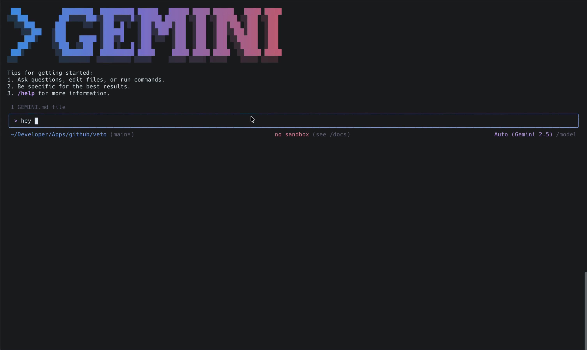
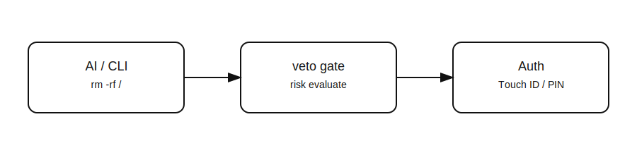

<p align="center">
  <h1 align="center">veto</h1>
  <p align="center">✋ Stop AI (or yourself) from running dangerous shell commands without your say‑so</p>
</p>

<p align="center">
  <a href="LICENSE"></a>
  <a href="https://github.com/runkids/veto/releases"></a>
  <a href="https://github.com/runkids/veto/releases"></a>
  <a href="https://github.com/runkids/veto/actions/workflows/release.yml"></a>
  <a href="https://www.rust-lang.org/"></a>
  <a href="#platforms"></a>
</p>

<p align="center">
  <strong>Risk evaluation + authentication gate for shell commands.</strong><br>
  Built for Claude Code, Gemini CLI, Cursor CLI, & OpenCode, and works great as a standalone CLI.
</p>

<p align="center">
  
</p>

<p align="center">
  <a href="https://github.com/user-attachments/assets/e9424130-e5ab-4b58-afc6-b7efc356c90a" target="_blank" rel="noopener">
    
  </a>
</p>

---

## Why veto?

AI coding assistants can execute shell commands autonomously. **veto adds a risk‑based gate**:

- Evaluate risk level (`ALLOW` → `CRITICAL`) using built‑in + custom rules
- For higher risk, require authentication (Touch ID / PIN / TOTP / Telegram / confirm)
- Keep an audit trail of evaluations

If it’s safe, it runs. If it’s risky, you must approve.

## Who Is This For?

- AI coding users who allow tools to execute shell commands (Claude Code, Gemini CLI, Cursor CLI, OpenCode)
- Developers who want guardrails for destructive commands (`rm -rf`, `git push -f`, `chmod -R`)
- Teams that need a simple audit trail for command execution decisions

## 30‑Second Demo

```bash
veto check "rm -rf node_modules"
# Risk: MEDIUM

veto check -v "git push -f origin main"
# Risk: HIGH
# Category: git-destructive
# Reason: Destructive git operation
```

Try a protected execution:

```bash
veto exec "rm -rf node_modules"
# Prompts for confirmation based on risk level
```

---

## FAQ

**Will it block too much?**  
veto uses risk levels and pattern rules. Safe commands pass; higher‑risk ones require approval. You can tune rules and whitelists.

**Can it be bypassed?**  
Yes — any command run outside veto (or without AI hooks enabled) bypasses it. It’s a guardrail, not a sandbox.

**How do I customize rules?**  
Edit `~/.veto/rules.toml` to add categories, patterns, and whitelist entries. See [Rules](docs/rules.md).

---

## Results (Example Output)

Example categories and the kinds of commands they catch:

| Category | Example command | Typical risk |
|---|---|---|
| git-destructive | `git push -f origin main` | HIGH |
| filesystem-delete | `rm -rf /` | CRITICAL |
| permissions | `chmod -R 777 ./` | MEDIUM |
| secrets | `cat ~/.ssh/id_rsa` | CRITICAL |

Sample audit log snippet:

```text
2026-01-28 10:31:12  HIGH     DENIED    git push -f origin main
2026-01-28 10:33:05  MEDIUM   APPROVED  rm -rf node_modules
2026-01-28 10:40:22  CRITICAL DENIED    rm -rf /
```

---

## Install

Quick install:

```bash
curl -fsSL https://raw.githubusercontent.com/runkids/veto/main/install.sh | bash
```

Prefer to inspect the installer first?

```bash
curl -fsSL https://raw.githubusercontent.com/runkids/veto/main/install.sh -o install.sh
less install.sh
bash install.sh
```

Build from source: [Installation](docs/installation.md).

---

## Integrate with AI Tools

```bash
veto init
veto setup claude    # Claude Code
veto setup gemini    # Gemini CLI
veto setup cursor    # Cursor CLI
veto setup opencode  # OpenCode
veto doctor
```

Restart your AI tool. High‑risk commands will now require verification.

---

## How It Works (At a Glance)

<p align="center">
  
</p>

---

## Standalone CLI (No AI Required)

```bash
veto check "rm -rf /"
veto exec "git push -f origin main"
veto log -n 10
```

---

## Install / Upgrade / Uninstall

For full instructions and options, see:

- [Installation](docs/installation.md)
- [Claude Code integration](docs/claude-code.md)
- [Gemini CLI integration](docs/geminicli.md)
- [Cursor CLI integration](docs/cursorcli.md)
- [OpenCode integration](docs/opencode.md)

---

## Security Model (Threat Model Boundaries)

What veto helps with:

- Accidental destructive commands (e.g. recursive deletes, force pushes)
- Automation running higher-risk commands without explicit approval
- Visibility: an audit trail of command evaluations

What veto does NOT protect against:

- Bypass: running commands outside `veto` / without Claude Code hooks enabled
- A compromised host (malware, root compromise) or a compromised user account
- Malicious-but-benign-looking commands that don't match your rules
- "Approved but harmful": once you approve, veto will allow the command

Audit log privacy note: the audit log records command strings. Treat it as sensitive if your commands include secrets.

---

## Trust & Verification

- Inspect the installer first (download → inspect → run) in [Installation](docs/installation.md)
- Prefer source builds? `cargo build --release` is documented in [Installation](docs/installation.md)
- Clear threat model boundaries (see above)

---

## How It Compares

| Approach | What it does | What it misses |
|---|---|---|
| AI tool built‑in approvals | Stops some risky actions | Often not risk‑aware for shell commands |
| “Just be careful” | Zero setup | Human error still happens |
| Ad‑hoc scripts / aliases | Narrow guardrails | No risk levels, no audit trail |
| **veto** | Risk evaluation + auth + audit | Requires setup and hooks for AI tools |

---

## Custom Rules

Add your own rules in `~/.veto/rules.toml`:

```toml
[[critical]]
category = "secrets"
patterns = ["cat *.env*", "cat ~/.ssh/id_*"]
reason = "Sensitive file access"
challenge = true    # Require challenge code (prevents AI replay)

[whitelist]
commands = ["git status*", "docker ps*"]
```

Full rules syntax: [Rules](docs/rules.md).

---

## Platforms

| OS | Architecture | Touch ID |
|----|--------------|----------|
| macOS | x86_64 / arm64 | ✅ |
| Linux | x86_64 / arm64 | ✗ |

---

## Authentication Methods

- 🔐 PIN, 🔑 TOTP, 📱 Telegram, 👆 Touch ID (macOS), 💬 confirm
- 🎯 **Challenge-Response** — Prevent AI from reusing credentials (via notification)
- Setup: [Authentication](docs/authentication.md)

---

## Audit Log

Every evaluation is logged to `~/.veto/audit.log`.

```bash
veto log
veto log -n 10
veto log --filter DENIED
veto log -f
veto log --clear
```

---

## Documentation

- [Installation](docs/installation.md)
- [Commands](docs/commands.md)
- [Configuration](docs/configuration.md)
- [Rules](docs/rules.md)
- [Authentication](docs/authentication.md)
- [Claude Code Integration](docs/claude-code.md)
- [Gemini CLI Integration](docs/geminicli.md)
- [OpenCode Integration](docs/opencode.md)
- [Troubleshooting](docs/troubleshooting.md)

---

## Development

```bash
make build
make test
make release
make install
make sandbox
```

---

## License

MIT — see [LICENSE](LICENSE)
