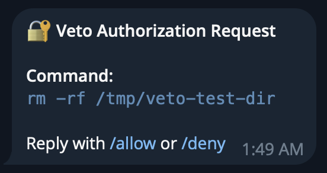
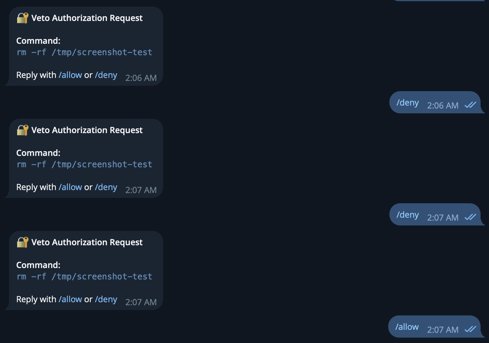
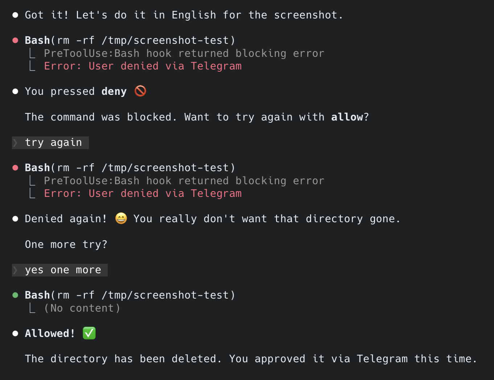

# Authentication

## Available Methods

| Method | Type | Platform | Security Level |
|--------|------|----------|----------------|
| `confirm` | Sync | All | Low — y/n prompt |
| `pin` | Sync | All | Medium — Argon2 hashed |
| `totp` | Sync | All | High — RFC 6238, 6-digit |
| `touchid` | Sync | macOS | High — Biometric |
| `telegram` | Async | All | High — Remote approval |

## Setup Methods

### PIN

```bash
veto auth set-pin
# Enter new PIN (minimum 4 characters): ****
# Confirm PIN: ****
# ✓ PIN configured successfully!
```

### TOTP (Google Authenticator)

```bash
veto auth setup-totp
# Scan QR code with authenticator app
# Enter 6-digit code to verify: 123456
# ✓ TOTP configured successfully!
```

Compatible apps:
- Google Authenticator
- Authy
- 1Password
- Any RFC 6238 compatible app

### Touch ID (macOS)

No setup required. Uses system authentication.

```bash
veto auth test touchid
# Touch ID / password verification required
# [Touch ID prompt appears]
# ✓ Authentication successful!
```

### Telegram

Telegram authentication sends approval requests to your phone. You approve or deny commands remotely via `/allow` or `/deny`.

#### Why Bot is Required

| Method | Send Message | Receive Reply | Works for veto |
|--------|--------------|---------------|----------------|
| Bot | ✅ | ✅ `/allow` `/deny` | ✅ |
| Channel | ✅ | ❌ Broadcast only | ❌ |
| Group | ✅ | ⚠️ Complex | ❌ |

Telegram Bot API is the only official way for programs to interact with users.

#### Step 1: Create a Bot (1 minute)

1. Open Telegram and search for **@BotFather**
2. Send `/newbot`
3. Enter a name for your bot: `Veto Auth`
4. Enter a username: `yourname_veto_bot` (must end with `_bot`)
5. **Copy the bot token** (looks like `123456789:ABCdefGHI-jklMNOpqrSTUvwxYZ`)

#### Step 2: Get Your Chat ID

1. Search for **@userinfobot** in Telegram
2. Send any message to it
3. **Copy your chat ID** (a number like `123456789`)

#### Step 3: Configure veto

```bash
# Store the bot token
veto auth setup-telegram
# Enter bot token: [paste your token]
# ✓ Telegram bot token stored!
```

Then add chat_id to `~/.veto/config.toml`:

```toml
[auth.telegram]
enabled = true
chat_id = "123456789"        # Your chat ID from @userinfobot
timeout_seconds = 60         # How long to wait for response
```

#### Step 4: Start Your Bot

**Important:** You must start a conversation with your bot before it can send you messages.

1. Search for your bot by its username (e.g., `@yourname_veto_bot`)
2. Click **Start** or send `/start`

#### Step 5: Test

```bash
veto auth test telegram
# Command: veto auth test
# Waiting for Telegram approval...
# [Check your Telegram - you should receive a message]
# Reply with /allow or /deny
```

#### Usage

When veto requires Telegram authentication, you'll receive a message like this:



Reply with `/allow` or `/deny`:



#### Claude Code Integration

When using with Claude Code, the AI will wait for your Telegram approval:



Reply with:
- `/allow` or `allow` or `yes` — Approve the command
- `/deny` or `deny` or `no` — Reject the command

## Verify Setup

```bash
veto auth list
# Configured authentication methods:
#   ✓ confirm - configured
#   ✓ pin - configured
#   ✓ totp - configured
#   ✓ touchid - configured
#   ✗ telegram - not configured

veto auth test pin
# Enter PIN: ****
# ✓ Authentication successful!
```

## Authentication Configuration

### Per-Level Authentication

Configure different auth methods for different risk levels:

```toml
[auth.levels]
low = "confirm"                    # Simple y/n
medium = "pin"                     # PIN required
high = "touchid"                   # Biometric (macOS)
critical = "telegram"              # Remote approval
```

### Fallback Configuration

When primary method is unavailable:

```toml
[auth.fallback]
touchid = "pin"       # Touch ID unavailable → use PIN
telegram = "totp"     # Telegram timeout → use TOTP
totp = "pin"          # TOTP not configured → use PIN
```

## Secret Storage

veto stores secrets using system keychain with automatic fallback:

| Backend | Platform | Location |
|---------|----------|----------|
| Keychain | macOS | macOS Keychain |
| Secret Service | Linux | GNOME Keyring / KWallet |
| File (fallback) | All | `~/.veto/secrets/*.enc` |

### Security Details

| Component | Algorithm |
|-----------|-----------|
| PIN | Argon2id + random salt |
| TOTP | HMAC-SHA1 (RFC 6238) |
| File encryption | AES-256-GCM + PBKDF2 (100k iterations) |

### Check Backend Status

```bash
veto doctor
# Keyring Status:
#   Backend: system
#   PIN configured: yes
#   TOTP configured: yes
#   Telegram configured: no
#   Keyring test: ✓ (write/read OK)
```

## Challenge-Response Authentication

For rules with `challenge = true`, veto adds an extra layer of security to prevent AI agents from reusing credentials.

### How It Works

1. When a command triggers a rule with `challenge = true`, veto generates a **4-digit challenge code**
2. The code is sent via notification (macOS) or Telegram (if configured)
3. The AI cannot see the code — it must ask the user
4. User provides the code, and AI retries with `VETO_RESPONSE`

### Response Format

| Auth Method | Format | Example |
|-------------|--------|---------|
| PIN | `VETO_RESPONSE=<PIN><challenge>` | `VETO_RESPONSE=12344827` |
| confirm | `VETO_RESPONSE=<challenge>` | `VETO_RESPONSE=4827` |
| TOTP | No challenge needed | `VETO_TOTP=123456` |

### Platform Support

| Platform | Notification Method |
|----------|---------------------|
| macOS | Native notification (osascript) + sound |
| Linux | `notify-send` (libnotify) or Telegram |

**Linux Requirements:**
- Install `libnotify`: `apt install libnotify-bin` (Debian/Ubuntu) or `dnf install libnotify` (Fedora)
- Or configure Telegram as fallback

### Challenge Properties

- **4 digits** — Easy to communicate verbally
- **60 second expiry** — Prevents delayed replay
- **Single use** — Cannot reuse same code
- **Command-bound** — Code only works for specific command

See [Rules](rules.md) for configuring `challenge = true` on rules.

---

## Managing Authentication

### Remove a Method

```bash
veto auth remove pin
veto auth remove totp
veto auth remove telegram
```

### Reset PIN

```bash
veto auth set-pin
# Will overwrite existing PIN
```

### Test Methods

```bash
veto auth test confirm
veto auth test pin
veto auth test totp
veto auth test touchid
veto auth test telegram
```
